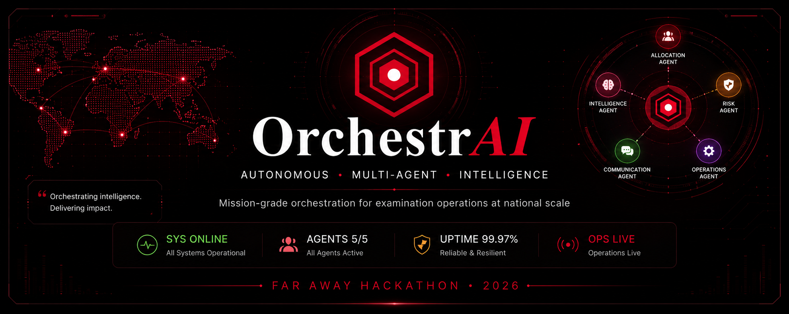
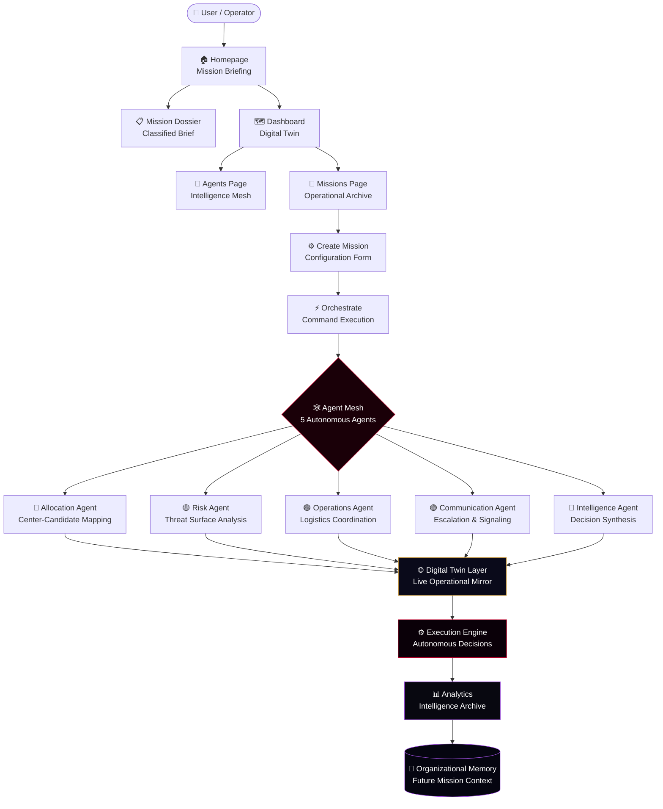
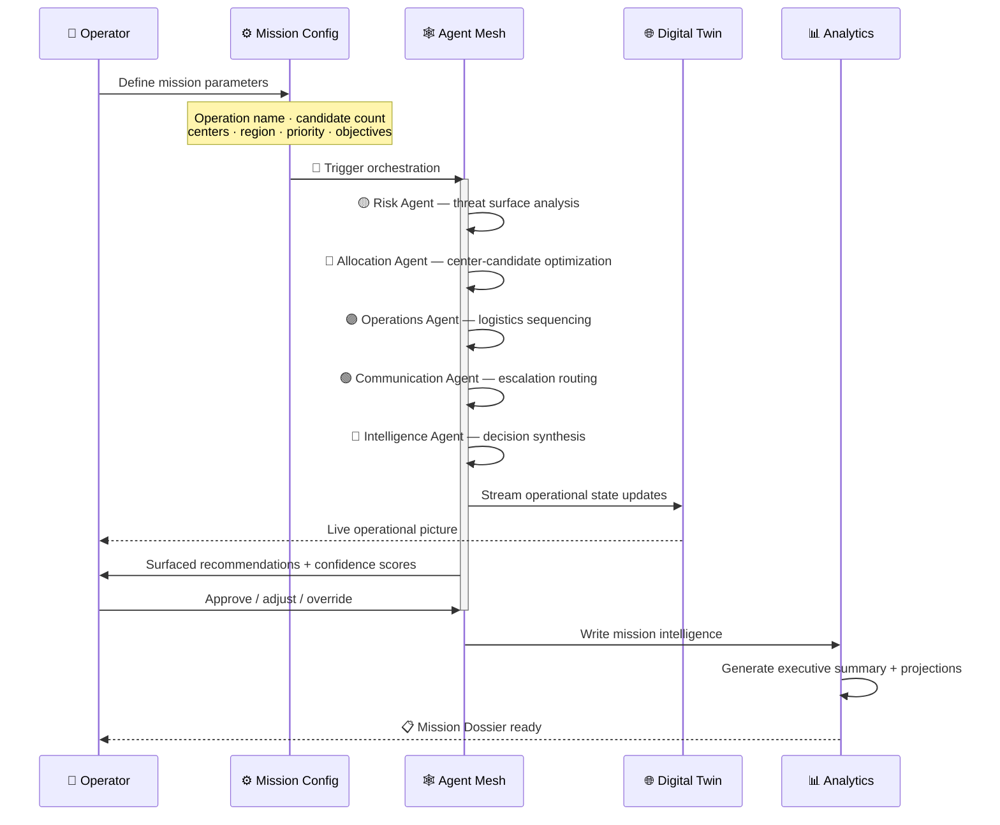

<div align="center">

<!-- BANNER -->


<br/>
<br/>

<!-- LIVE STATUS BAR -->
<table>
<tr>
<td align="center">🟢 &nbsp;<b>SYS ONLINE</b></td>
<td align="center">🔴 &nbsp;<b>AGENTS 5/5</b></td>
<td align="center">🔵 &nbsp;<b>UPTIME 99.97%</b></td>
<td align="center">🟡 &nbsp;<b>OPS LIVE</b></td>
</tr>
</table>

<br/>

<!-- BADGES -->
[](https://react.dev)
[](https://threejs.org)
[](https://framer.com/motion)
[](https://python.org)
[](https://fastapi.tiangolo.com)
[](https://langchain-ai.github.io/langgraph/)
[](./LICENSE)

<br/>

> ### ✦ *Five agents. One command. Total clarity.* ✦
> *Mission-grade orchestration for examination operations at national scale*

<br/>

**[🚀 Enter Platform](#-getting-started) &nbsp;·&nbsp; [🏗️ Architecture](#%EF%B8%8F-system-architecture) &nbsp;·&nbsp; [🤖 Agent Ecosystem](#-agent-ecosystem) &nbsp;·&nbsp; [📸 Screenshots](#-screenshots) &nbsp;·&nbsp; [📊 Impact](#-impact-metrics)**

</div>

---

<br/>

## 💀 The Problem Nobody Is Solving

Every year, India's national examinations — NEET, JEE, UPSC, state boards — coordinate **millions of candidates** across **thousands of centers**, spanning every geography, infrastructure class, and risk profile imaginable.

The current reality? It's held together with spreadsheets, phone calls, and hope.

<br/>

| 🔴 &nbsp; The Status Quo | 💸 &nbsp; The Real Cost |
|---|---|
| Center allocation via static spreadsheets, weeks in advance | Blind to real-time capacity shifts |
| Manual risk identification | Problems surface *after* they ruin someone's shot |
| Logistics conflicts discovered during execution | No proactive sequencing — just firefighting |
| Post-exam analysis as forensic exercise | Zero feedback loop for future operations |
| Human bottlenecks at every critical decision | One failure cascades across an entire region |

<br/>

> **At 1.2 million candidates, a 3% allocation suboptimality means 36,000 people traveling further than they should have to.** A single undetected infrastructure risk disrupts an entire center's cohort. A 2am communication failure costs thousands of people their examination window.

<br/>

---

## ✨ The Solution

**OrchestrAI** is a **Mission-Control platform for examination operations** — a coordinated mesh of five specialized AI agents that perceive, reason, and act across every dimension of an examination *simultaneously*.

Instead of one generalist model doing everything badly → **five purpose-built experts operating as a collective intelligence.** Instead of replacing the human coordinator → giving them **total situational awareness and zero-latency decision support.**

Every examination operation is a **Mission.** Every mission flows through an autonomous orchestration pipeline — risk-scored, optimally allocated, monitored, and analyzed — before a single candidate walks through a center door.

<br/>

---

## 🌟 Key Features

<br/>

| Token | Feature | What It Does |
|:---:|---|---|
| `🔮 TWIN` | **Live Digital Twin** | Real-time computational mirror of 18 centers across 5 regions — capacity, load, risk, and flow updating in live time |
| `🕸️ MESH` | **5-Agent Autonomous Mesh** | Allocation · Risk · Operations · Communication · Intelligence — purpose-built, specialized, signal-coordinated |
| `🎯 EXEC` | **Mission-Based Workflow** | Every operation is a first-class Mission: creation → orchestration → dossier. Nothing falls through the cracks. |
| `🌐 VIZ` | **React Three Fiber 3D** | Production-quality 3D agent lattice and orchestration core rendered natively in-browser |
| `📡 INTEL` | **Analytics Intelligence Layer** | Post-mission outcomes become organizational memory — not summaries, actual agent output traces |
| `📋 BRIEF` | **Mission Dossier** | Classified-intelligence-style brief per mission — 10-section scroll-driven narrative |
| `💎 DESIGN` | **Cinematic Design System** | Japanese Futuristic Luxury × Classified Intelligence Briefing — every pixel intentional |

<br/>

---

## 📸 Screenshots

<br/>

### 🖥️ Homepage — Operational Status Terminal


The entry point is not a marketing page — it's an **operational status terminal.** The status bar at the top shows live system health before any scroll. A React Three Fiber 3D agent lattice dominates the right panel, with glassmorphic agent detail cards appearing on hover. Live stats anchor the bottom: `2,47,760 OPS/SEC · 5/5 AGENTS · 18ms LATENCY · 99.97% UPTIME`.

<br/>

---

### 🗺️ Dashboard — Digital Twin


The Dashboard is OrchestrAI's most technically significant page — a **live Digital Twin** of the national examination operations network. 18 center nodes render across 5 geographic regions. Color encodes health at a glance:

- 🔵 **Teal** = Nominal
- 🟡 **Gold** = Elevated
- 🔴 **Red** = Critical

The Orchestration Core pulses at the map center. Animated dashed lines show active data flows. Aggregate telemetry renders top-right: `18/18 Centers · 81.4% Capacity · 4 Risk Nodes · Active Flows`.

<br/>

---

### ⚡ Orchestrate — Command Execution


Mission control at the moment of execution — three simultaneous panels:

- **Left:** Mission Configuration — operation name, candidate count, centers, region, priority, optimization objectives
- **Center:** React Three Fiber 3D agent execution core — agents orbit the orchestration diamond in real time with visible reasoning streams
- **Right:** Live digital twin minimap — candidate distribution updating as agents execute

<br/>

---

### 🤖 Agents — Intelligence Mesh


A force-directed agent network graph where selecting any agent expands a full detail panel: role, domain, core capabilities, signal flow, and live telemetry. Intelligence Agent panel shows: `99% decision confidence · 91% agent load · 683 decisions today · 12ms avg latency`.

<br/>

---

### 📊 Analytics — Operational Intelligence Archive

> `screenshots/analytics.png`


Post-mission outcomes rendered as a precision intelligence brief — every number traces to a specific autonomous agent decision, not an estimate.

| Metric | Result | Delta |
|---|---|---|
| Allocation Efficiency | **94%** | +22pp vs manual baseline |
| Avg Center Utilization | **94%** | From 72% pre-orchestration |
| Travel Distance | **↓23%** | 31km → 24km avg per candidate |
| System Confidence | **97%** | Above 95% threshold |
| Risk Score (North Region) | **↓75%** | 89 → 22 after autonomous reallocation |
| Total Decisions | **847** | Resolved in 6.2s |
| Human Interventions | **0** | In the critical execution path |

<br/>

---

### 📁 Mission Dossier — Classified Intelligence Brief

> `screenshots/dossier.png`


OrchestrAI's flagship storytelling interface — a completed mission rendered as a **classified intelligence document.** Scroll-driven animations reveal 10 sections: mission header, interactive SVG agent network, operational timeline, decision log with confidence scores, anomaly surface, allocation outcome map, center performance grid, candidate impact summary, agent performance breakdown, and executive conclusions with forward projections.

<br/>

---

## 📈 Impact Metrics

<div align="center">

| 🎯 847 Decisions | ⚡ 6.2 Seconds | 🏆 94% Efficiency | 🛡️ 0 Human Interventions |
|:---:|:---:|:---:|:---:|
| Total autonomous decisions | End-to-end resolution | Allocation efficiency | In the critical path |

<br/>

| 📉 ↓75% Risk | 📏 ↓23% Travel | 💡 99% Confidence | 🌐 18 Centers |
|:---:|:---:|:---:|:---:|
| North Region risk drop | Per-candidate distance | Intelligence Agent | Live in Digital Twin |

</div>

<br/>

---

## 🏗️ System Architecture



<br/>

---

## 🤖 Agent Ecosystem

> The deliberate choice to use five specialized agents — rather than one large model — reflects a core architectural principle: **domain expertise compounds.**

A generalist model optimizing allocation, risk, logistics, communication, and synthesis simultaneously produces average results across all five. Five specialists, each with a narrow and deep scope, communicating through structured inter-agent signals, produce outcomes no single model can match.

<br/>

### 🔴 Allocation Agent — `Center-Candidate Assignment`

Finds the allocation that minimizes travel distance, maximizes capacity utilization, respects accessibility constraints, and preserves backup capacity for disruption scenarios. Outputs ranked allocations with confidence scores — not a single answer, a decision surface.

```
Signal Flow:  Ingests candidate geographic distribution from Risk Agent
          →   Outputs center assignment matrix to Operations Agent
          →   Reports efficiency score to Intelligence Agent

NEET 2027 result: +22pp allocation efficiency over manual baseline
```

---

### 🟡 Risk Agent — `Threat Surface Identification`

Continuously monitors infrastructure vulnerability, candidate concentration density, weather and access disruption probability, proctor availability gaps, and historical incident patterns. Outputs a risk score (0–100) per center with prioritized mitigation actions.

```
Signal Flow:  Ingests center telemetry + historical incident data
          →   Outputs risk surface to Allocation Agent
          →   Escalates high-severity signals to Communication Agent

NEET 2027 result: North Region risk score ↓75% (89 → 22) before any disruption materialized
```

---

### 🟣 Operations Agent — `Logistics Coordination`

Manages proctor deployment, center readiness verification, supply chain logistics, and real-time disruption response. Sequences dependent execution chains — center unlock, proctor arrival, candidate admittance — and resolves conflicts when parallel chains collide.

```
Signal Flow:  Ingests allocation matrix from Allocation Agent
          →   Coordinates execution sequences
          →   Reports operational status to Intelligence Agent

Coordination latency: 14ms
```

---

### 🟢 Communication Agent — `Stakeholder Signaling`

Manages the escalation hierarchy: which signals require human attention, which are handled autonomously, and how priority translates into communication urgency (`NORMAL → HIGH → CRITICAL`). Suppresses noise, amplifies signal.

```
Signal Flow:  Ingests escalation triggers from Risk and Operations Agents
          →   Routes structured communication payloads
          →   Reports outcomes to Intelligence Agent
```

---

### 🔵 Intelligence Agent — `Decision Synthesis`

The strategic layer. Ingests telemetry from all four peer agents. Synthesizes into high-confidence decisions, surfaces anomalies human analysts would miss, generates post-mission analysis, and continuously improves strategy through each operational cycle.

```
Signal Flow:  Ingests all agent telemetry
          →   Outputs tactical recommendations + strategic projections
          →   Writes mission intelligence to Analytics archive

NEET 2027 result: 99% decision confidence · 683 decisions · 12ms latency
```

<br/>

### 🔀 Agent Signal Flow



<br/>

---

## 🌐 Digital Twin Layer

A Digital Twin is a **live computational mirror** of a physical system. In OrchestrAI, that physical system is the national examination operations network — thousands of centers, millions of candidates, hundreds of proctors, and the logistics infrastructure connecting them.

The Dashboard Twin renders:

- 🗂️ **18 center nodes** across 5 geographic regions — each encoding live capacity, candidate load, and operational status
- 🎨 **Color-coded health signals:** teal (nominal) · gold (elevated) · red (critical)  
- 〰️ **Animated data flows** between centers as agents process telemetry in real time
- 💠 **The Orchestration Core** — the central command node synthesizing all agent intelligence into a unified picture
- 🗺️ **Regional clustering** for geographic situational awareness at a glance

> Every operational decision is **visible, traceable, and reversible.** The Digital Twin makes that possible.

<br/>

---

## 🛠️ Technology Stack

### 🎨 Frontend

| Technology | Purpose |
|---|---|
| **React 18** | Component architecture and SPA routing |
| **React Three Fiber + Three.js** | 3D agent lattice, orchestration core, sakura crystal artifact |
| **Framer Motion** | Page transitions, scroll-driven animations, micro-interactions |
| **React Router v6** | Multi-page client-side routing |
| **Canvas API** | Sakura petal particle system |

### 💎 Design System

| Token | Value | Usage |
|---|---|---|
| `--void` | `#030208` | Primary background |
| `--crimson` | `#C4002B` | Primary action · alerts · agent highlight |
| `--gold` | `#BF8C2C` | Secondary accent · elevated states |
| `--sakura` | `#E8A0B0` | Tertiary accent · Intelligence Agent |
| `--parchment` | `#F0EBE1` | Mission Dossier document surface |
| Typography | **Cormorant Garamond + Space Grotesk + Inter** | Editorial · Data · Body |

### ⚙️ Backend

| Technology | Purpose |
|---|---|
| **Python 3.11 + FastAPI** | Agent logic, API endpoints, WebSocket streaming |
| **SQLAlchemy** | Database models — centers, students, allocations, audit logs |
| **Pydantic** | Request/response validation schemas |
| **LangGraph** | Multi-agent orchestration engine and state loop |
| **seed_data.py** | Examination center and candidate dataset generation |

<br/>

### 📁 Project Structure

```
Orchestr-AI/
│
├── 📸 screenshots/                   ← ADD YOUR SCREENSHOTS HERE
│   ├── homepage.png
│   ├── dashboard.png
│   ├── orchestrate.png
│   ├── agents.png
│   ├── analytics.png
│   └── dossier.png
│
├── 🎨 frontend/
│   └── src/
│       ├── pages/
│       │   ├── HomePage.jsx          # ✨ Cinematic landing + 3D agent lattice
│       │   ├── Dashboard.jsx         # 🗺️ Digital Twin operations map
│       │   ├── AgentsPage.jsx        # 🤖 Agent network + detail panels
│       │   ├── MissionsPage.jsx      # 📁 Mission archive + fuzzy search
│       │   ├── NewMissionPage.jsx    # ⚙️ 3-step mission creation flow
│       │   ├── OrchestratePage.jsx   # ⚡ 3-panel command execution
│       │   ├── MissionDossier.jsx    # 📋 10-section intelligence brief
│       │   └── AnalyticsPage.jsx     # 📊 Operational intelligence archive
│       └── components/
│
├── 🐍 app/
│   ├── main.py                       # FastAPI app + WebSocket setup
│   ├── core/
│   │   ├── config.py                 # Environment variables
│   │   └── database.py              # SQLAlchemy connection
│   ├── models/                       # Database models
│   │   ├── center.py
│   │   ├── student.py
│   │   ├── allocation.py
│   │   └── audit_log.py
│   ├── schemas/                      # Pydantic validation schemas
│   │   ├── allocation.py
│   │   └── analytics.py
│   ├── routers/                      # API endpoints by domain
│   │   ├── orchestrate.py           # Triggers agent loop
│   │   ├── analytics.py             # Dashboard stats
│   │   └── stream.py                # WebSocket live updates
│   └── agents/                       # 🕸️ Multi-agent layer
│       ├── engine.py                 # LangGraph workflow manager
│       ├── allocation_agent.py
│       └── risk_agent.py
│
├── seed_data.py                      # Mock data injector
└── requirements.txt
```

<br/>

---

## 🚀 Getting Started

### Prerequisites

```
Node.js 18+    npm or yarn    Python 3.11+
```

### ⚡ Frontend (30 seconds)

```bash
git clone https://github.com/khyatiagrawal-2025/Orchestr-AI.git
cd Orchestr-AI/frontend
npm install
npm run dev
# → http://localhost:5173
```

### 🐍 Backend

```bash
# From repository root
pip install -r requirements.txt
python seed_data.py          # Seed examination operations data
cd app && python main.py     # → http://localhost:8000
```

### 🔥 Full Stack (two terminals)

```bash
# Terminal 1 — Backend
pip install -r requirements.txt && python seed_data.py && cd app && python main.py

# Terminal 2 — Frontend
cd frontend && npm install && npm run dev
```

<br/>

---

## 🗺️ Roadmap

**🟢 Near-Term**
- [ ] Real-time integration with NTA / CBSE examination board data feeds
- [ ] GIS-layer overlays on the Digital Twin with road network and transit data
- [ ] Live center status streaming via webhooks during active examination windows
- [ ] Candidate notification pipeline through Communication Agent (SMS + push)

**🟡 Medium-Term**
- [ ] Predictive resource allocation — Risk Agent pre-positions proctors before threshold is crossed
- [ ] Emergency response — automatic candidate reallocation on center failure, zero human latency
- [ ] Multi-examination coordination — simultaneous orchestration of parallel operations
- [ ] Agent learning loop — Intelligence Agent fine-tuning from accumulated mission outcomes

**🔮 Long-Term**
- [ ] **Cross-domain expansion:** Hospital capacity, disaster response, large-scale event management, supply chain — same 5-agent architecture, new domains
- [ ] **Agent marketplace:** Compose domain-specialized agent modules for any operational context
- [ ] **Federated Digital Twin:** Regional twins federating into a national operational picture shared across examination boards

<br/>

---

## 💡 Why OrchestrAI Matters

OrchestrAI doesn't make examination operations futuristic. It makes them **what they should already be** — fully visible, proactively managed, and continuously improving.

The platform demonstrates something more broadly significant: **multi-agent AI systems can manage complex real-world operations in domains where the cost of failure is measured in human outcomes, not error rates.** Examination fairness — ensuring every candidate gets a fair shot regardless of which center they're assigned — is exactly such a domain.

There are many others. **OrchestrAI is a proof of architecture, not just a proof of concept.**

<br/>

---

## 👥 Team

<table>
<tr>
<td align="center" width="25%">

### 🏗️ Ravi Ranjan
`Product & AI Architecture`

Leads overall product direction and the autonomous agent architecture. Defines how agents communicate, coordinate, and escalate across the platform.


</td>
<td align="center" width="25%">

### 🎨 Khyati Agrawal
`Frontend Engineering`

Owns the entire frontend experience — from the 3D agent lattice to the Digital Twin visualization. Responsible for design language, motion system, and interactive storytelling.


</td>
<td align="center" width="25%">

### 🧪 Madhu Shankar Kumar
`QA, Testing & Documentation`

Ensures platform reliability across all agent interactions. Builds the testing infrastructure that validates autonomous decision chains and documents platform behavior.


</td>
<td align="center" width="25%">

### 🔬 Ujjwal
`Research & Infrastructure`

Grounds the platform in research-backed agent patterns and manages the infrastructure that makes real-time autonomous coordination possible at scale.


</td>
</tr>
</table>

<br/>


---

<div align="center">

### ✦ Built with precision &nbsp;·&nbsp; Powered by autonomous agents &nbsp;·&nbsp; Designed for operations at scale ✦

<br/>

```
╔══════════════════════════════════════════════════════════════════════╗
║   ORCHESTRAI · AUTONOMOUS MULTI-AGENT INTELLIGENCE                   ║
║   FAR AWAY HACKATHON · 2026 · GLOBAL COMPETITION                     ║
╚══════════════════════════════════════════════════════════════════════╝
```

<br/>

*Made with ❤️ + 🔴 + ✨ by Team OrchestrAI*

</div>