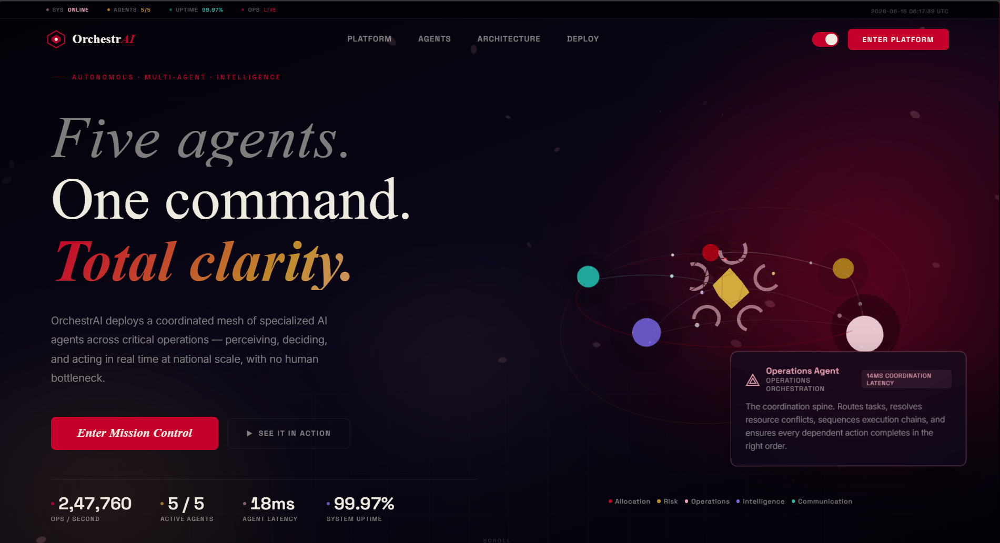
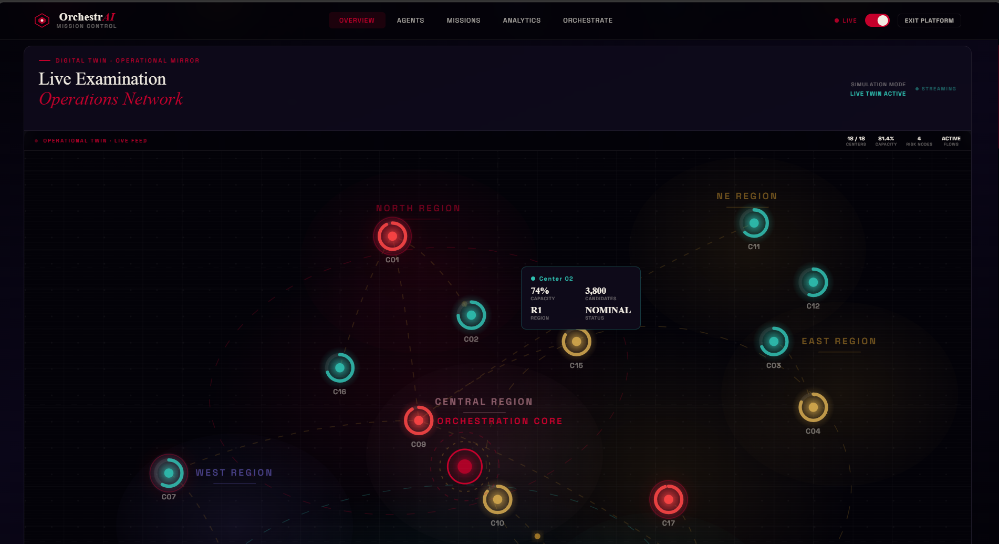
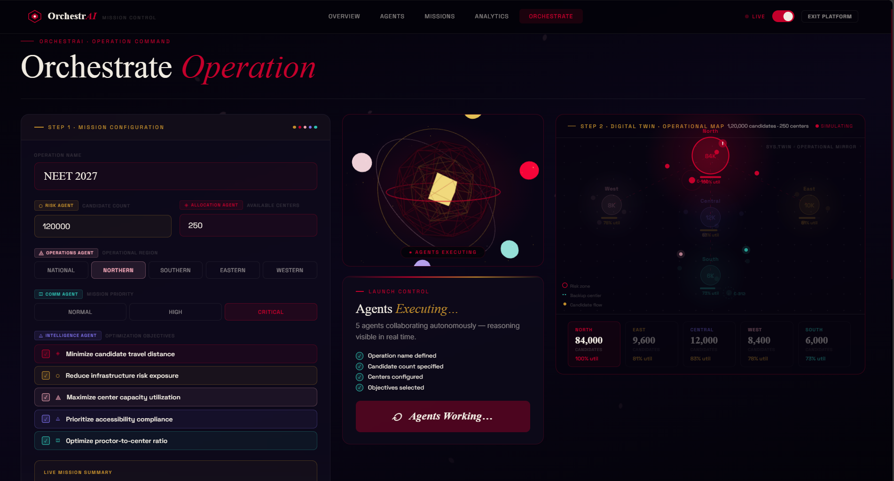
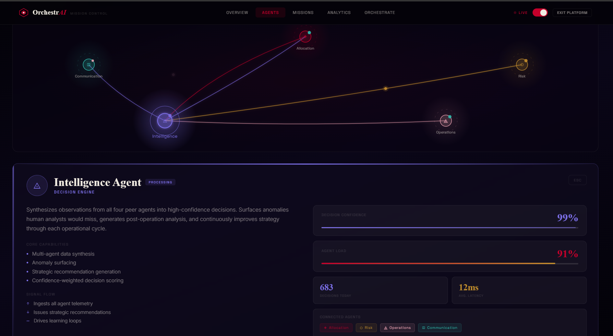
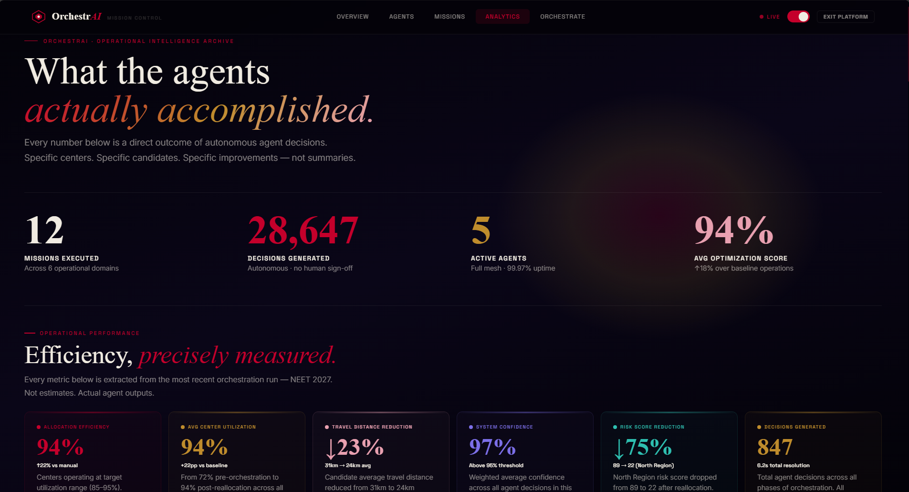
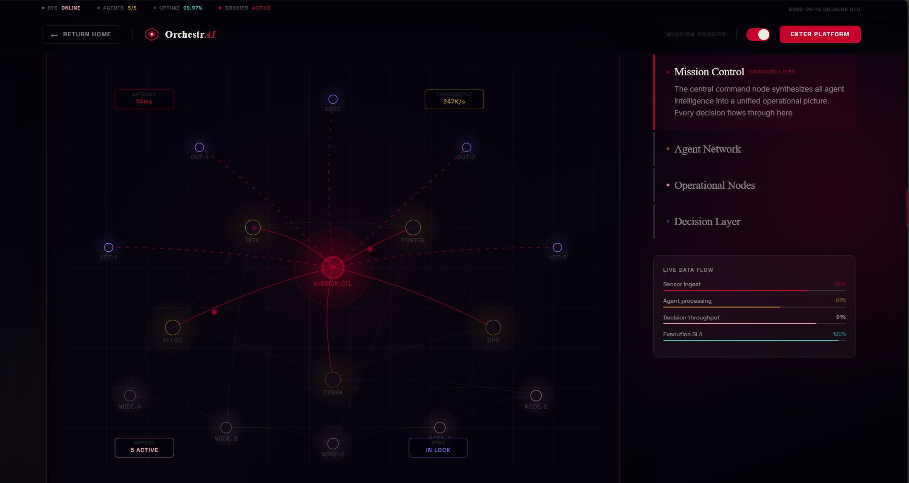
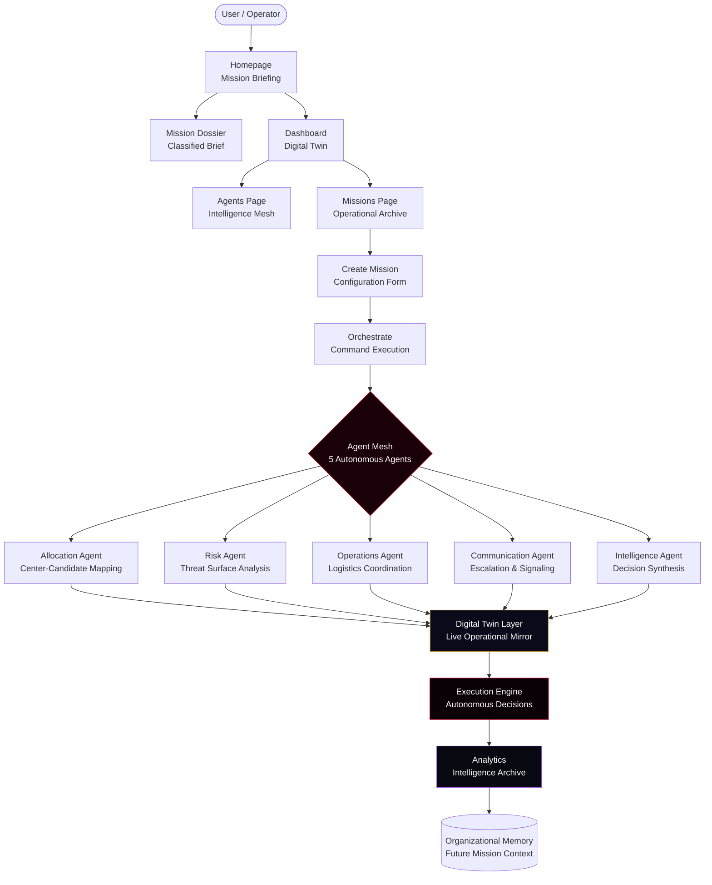

<div align="center">

<svg width="900" height="220" viewBox="0 0 900 220" xmlns="http://www.w3.org/2000/svg">
  <defs>
    <radialGradient id="bg" cx="50%" cy="50%" r="70%">
      <stop offset="0%" stop-color="#1a0008"/>
      <stop offset="60%" stop-color="#0d0005"/>
      <stop offset="100%" stop-color="#030208"/>
    </radialGradient>
    <radialGradient id="glow1" cx="50%" cy="50%" r="50%">
      <stop offset="0%" stop-color="#C4002B" stop-opacity="0.3"/>
      <stop offset="100%" stop-color="#C4002B" stop-opacity="0"/>
    </radialGradient>
    <radialGradient id="glow2" cx="50%" cy="50%" r="50%">
      <stop offset="0%" stop-color="#BF8C2C" stop-opacity="0.2"/>
      <stop offset="100%" stop-color="#BF8C2C" stop-opacity="0"/>
    </radialGradient>
    <filter id="blur1"><feGaussianBlur stdDeviation="18"/></filter>
  </defs>
  <rect width="900" height="220" fill="url(#bg)" rx="12"/>
  <ellipse cx="450" cy="110" rx="320" ry="120" fill="url(#glow1)" filter="url(#blur1)" opacity="0.8"/>
  <ellipse cx="720" cy="60" rx="140" ry="90" fill="url(#glow2)" filter="url(#blur1)" opacity="0.5"/>
  <line x1="0" y1="55" x2="900" y2="55" stroke="#C4002B" stroke-opacity="0.06" stroke-width="1"/>
  <line x1="0" y1="110" x2="900" y2="110" stroke="#C4002B" stroke-opacity="0.04" stroke-width="1"/>
  <line x1="0" y1="165" x2="900" y2="165" stroke="#C4002B" stroke-opacity="0.06" stroke-width="1"/>
  <line x1="225" y1="0" x2="225" y2="220" stroke="#C4002B" stroke-opacity="0.04" stroke-width="1"/>
  <line x1="450" y1="0" x2="450" y2="220" stroke="#C4002B" stroke-opacity="0.04" stroke-width="1"/>
  <line x1="675" y1="0" x2="675" y2="220" stroke="#C4002B" stroke-opacity="0.04" stroke-width="1"/>
  <g transform="translate(135, 110)">
    <polygon points="0,-38 33,-19 33,19 0,38 -33,19 -33,-19" fill="none" stroke="#C4002B" stroke-width="2.5" opacity="0.9"/>
    <polygon points="0,-26 22,-13 22,13 0,26 -22,13 -22,-13" fill="none" stroke="#C4002B" stroke-width="1.5" opacity="0.5"/>
    <circle cx="0" cy="0" r="10" fill="#C4002B" opacity="0.9"/>
    <circle cx="0" cy="0" r="4" fill="#ffffff" opacity="0.95"/>
    <circle cx="0" cy="0" r="48" fill="none" stroke="#C4002B" stroke-width="0.5" stroke-dasharray="4 6" opacity="0.3"/>
    <circle cx="0" cy="-48" r="3" fill="#BF8C2C" opacity="0.8"/>
    <circle cx="41.6" cy="24" r="3" fill="#E8A0B0" opacity="0.8"/>
    <circle cx="-41.6" cy="24" r="3" fill="#00B4D8" opacity="0.8"/>
    <circle cx="41.6" cy="-24" r="2.5" fill="#9d4edd" opacity="0.7"/>
    <circle cx="-41.6" cy="-24" r="2.5" fill="#52b788" opacity="0.7"/>
    <line x1="0" y1="0" x2="0" y2="-48" stroke="#BF8C2C" stroke-width="0.8" opacity="0.4"/>
    <line x1="0" y1="0" x2="41.6" y2="24" stroke="#E8A0B0" stroke-width="0.8" opacity="0.4"/>
    <line x1="0" y1="0" x2="-41.6" y2="24" stroke="#00B4D8" stroke-width="0.8" opacity="0.4"/>
    <line x1="0" y1="0" x2="41.6" y2="-24" stroke="#9d4edd" stroke-width="0.8" opacity="0.4"/>
    <line x1="0" y1="0" x2="-41.6" y2="-24" stroke="#52b788" stroke-width="0.8" opacity="0.4"/>
  </g>
  <text x="450" y="88" font-family="Georgia, serif" font-size="52" font-weight="700" fill="#ffffff" text-anchor="middle" letter-spacing="1">Orchestr<tspan fill="#C4002B" font-style="italic">AI</tspan></text>
  <text x="450" y="120" font-family="'Courier New', monospace" font-size="11" fill="#888888" text-anchor="middle" letter-spacing="4">AUTONOMOUS · MULTI-AGENT · INTELLIGENCE</text>
  <text x="450" y="150" font-family="Georgia, serif" font-size="14" fill="#cccccc" text-anchor="middle" font-style="italic" opacity="0.75">Mission-grade orchestration for examination operations at national scale</text>
  <rect x="0" y="196" width="900" height="24" fill="#0a0003" rx="0" opacity="0.8"/>
  <circle cx="24" cy="208" r="4" fill="#22c55e"/>
  <text x="34" y="212" font-family="'Courier New', monospace" font-size="9" fill="#22c55e" letter-spacing="1">SYS ONLINE</text>
  <circle cx="140" cy="208" r="4" fill="#BF8C2C"/>
  <text x="150" y="212" font-family="'Courier New', monospace" font-size="9" fill="#BF8C2C" letter-spacing="1">AGENTS 5/5</text>
  <circle cx="254" cy="208" r="4" fill="#00B4D8"/>
  <text x="264" y="212" font-family="'Courier New', monospace" font-size="9" fill="#00B4D8" letter-spacing="1">UPTIME 99.97%</text>
  <circle cx="388" cy="208" r="4" fill="#C4002B"/>
  <text x="398" y="212" font-family="'Courier New', monospace" font-size="9" fill="#C4002B" letter-spacing="1">OPS LIVE</text>
  <text x="876" y="212" font-family="'Courier New', monospace" font-size="8" fill="#555555" text-anchor="end">FAR AWAY HACKATHON · 2026</text>
</svg>

<br/>

[](https://react.dev)
[](https://threejs.org)
[](https://framer.com/motion)
[](https://python.org)
[](https://github.com/khyatiagrawal-2025/Orchestr-AI)

**Five agents. One command. Total clarity.**

[Enter Platform](#getting-started) · [View Architecture](#system-architecture) · [Meet the Agents](#agent-ecosystem) · [See Analytics](#screenshots)

</div>

---

## The Problem

Every year, national-scale examinations — NEET, JEE, UPSC, and state equivalents — coordinate millions of candidates across thousands of centers spanning every geography, infrastructure class, and risk profile imaginable. The operations behind them are invisible to most — and catastrophically fragile under the hood.

| The Status Quo | The Cost |
|---|---|
| Center allocation via static spreadsheets, weeks in advance | Blind to real-time capacity shifts |
| Manual risk identification | Problems surface *after* they impact candidates |
| Logistics conflicts found during execution | No proactive sequencing |
| Post-exam analysis as forensic exercise | No feedback loop |
| Human bottlenecks at every critical decision | Cascading failures at scale |

> At 1.2 million candidates, a 3% allocation suboptimality means **36,000 candidates** traveling further than necessary. A single undetected infrastructure risk disrupts an entire center's cohort.

**OrchestrAI was built for this exact problem.**

---

## The Solution

OrchestrAI is a **Mission-Control platform for examination operations** — a coordinated mesh of five specialized AI agents that perceive, reason, and act across every dimension of an examination simultaneously.

Instead of replacing the human coordinator, OrchestrAI gives them **total situational awareness and zero-latency decision support.** Instead of one generalist model doing everything, five purpose-built agents operate as a collective intelligence — each expert in its domain, each informing the others.

> *Five agents. One command. Total clarity.*

---

## Screenshots

<table>
<tr>
<td width="50%">

### Homepage — Operational Status Terminal

The entry point is not a marketing page — it's an **operational status terminal.** Live system health, a real-time 3D agent lattice, and glassmorphic agent detail cards load before any navigation. The platform communicates its state from the first pixel.

`2,47,760 OPS/SEC · 5/5 AGENTS · 18ms LATENCY · 99.97% UPTIME`

</td>
<td width="50%">



</td>
</tr>
<tr>
<td width="50%">

### Dashboard — Digital Twin

18 examination centers rendered as a live operational network across 5 geographic regions. Color-coded health: **teal** = nominal, **gold** = elevated, **red** = critical. The Orchestration Core pulses at the center of the map.

`18/18 Centers · 81.4% Capacity · 4 Risk Nodes · Active Flows`

</td>
<td width="50%">



</td>
</tr>
<tr>
<td width="50%">

### Orchestrate — Command Execution

Three simultaneous panels: mission configuration form, a React Three Fiber 3D agent execution core, and a live digital twin operational map. Agents execute with visible reasoning streams — not a progress bar, a genuine operational picture.

</td>
<td width="50%">



</td>
</tr>
<tr>
<td width="50%">

### Agents — Intelligence Mesh

Force-directed agent network with deep-detail expansion panels. Each agent surfaces live metrics: decision confidence, agent load, decisions generated today, latency, and connected agent topology.

`Intelligence Agent: 99% confidence · 91% load · 683 decisions · 12ms`

</td>
<td width="50%">



</td>
</tr>
<tr>
<td width="50%">

### Analytics — Operational Intelligence Archive

Post-mission outcomes rendered as a precision intelligence brief. Every metric traces to a specific autonomous agent decision — not estimates, actual agent outputs from NEET 2027.

</td>
<td width="50%">



</td>
</tr>
<tr>
<td width="50%">

### Mission Dossier — Classified Intelligence Brief

A scroll-driven 10-section narrative arc presenting a completed mission as a classified intelligence document — from mission header through executive conclusions and forward projections.

</td>
<td width="50%">



</td>
</tr>
</table>

---

## Key Features

| Capability | Description |
|---|---|
| 🗺️ **Digital Twin Dashboard** | Live operational mirror of every center, region, and candidate flow |
| 🤖 **5-Agent Autonomous Mesh** | Specialized agents: Allocation, Risk, Operations, Communication, Intelligence |
| 🎯 **Mission-Based Workflow** | Full lifecycle per operation: creation → orchestration → analysis |
| 📋 **Mission Dossier** | Classified-intelligence-style briefing with scroll-driven animations |
| ⚡ **Orchestrate Engine** | 3-panel live execution: mission config + 3D agent core + operational map |
| 📊 **Analytics Intelligence Layer** | Mission outcomes become organizational memory with confidence scores |
| 🌐 **React Three Fiber Visualizations** | Production-quality 3D agent lattice rendered entirely in-browser |
| 🎨 **Cinematic Design System** | Japanese Futuristic Luxury × Classified Intel — Cormorant Garamond + Space Grotesk |

---

## NEET 2027 Mission Results

> *Every number below is a direct outcome of autonomous agent decisions. Not estimates. Actual outputs.*

| Metric | Result | Delta |
|---|---|---|
| Allocation Efficiency | **94%** | +22pp vs manual baseline |
| Avg Center Utilization | **94%** | From 72% pre-orchestration |
| Travel Distance | **↓23%** | 31km → 24km avg per candidate |
| System Confidence | **97%** | Above 95% threshold |
| Risk Score (North Region) | **↓75%** | 89 → 22 after reallocation |
| Total Decisions | **847** | Resolved in 6.2s |
| Human Interventions | **0** | In the critical path |

---

## System Architecture



---

## Agent Ecosystem

The deliberate choice to use five specialized agents — rather than one large model — reflects a core architectural principle: **domain expertise compounds.**

A generalist model optimizing allocation, risk, logistics, communication, and synthesis simultaneously produces average results across all five. Five specialists, each with a narrow and deep scope, communicating through structured inter-agent signals, produce outcomes no generalist can match.

<table>
<tr>
<td width="20%" align="center">

**🔴 Allocation Agent**

`Center-Candidate Assignment`

Finds the allocation that minimizes travel distance, maximizes utilization, respects accessibility constraints, and preserves backup capacity. Outputs ranked allocations with confidence scores.

**+22pp** over manual baseline

</td>
<td width="20%" align="center">

**🟡 Risk Agent**

`Threat Surface Identification`

Continuously monitors infrastructure vulnerability, candidate density, weather disruption probability, proctor gaps, and historical incident patterns. Outputs a risk score per center with mitigation actions.

**↓75%** risk score reduction

</td>
<td width="20%" align="center">

**🟣 Operations Agent**

`Logistics Coordination`

Manages proctor deployment, center readiness, supply chain, and real-time disruption response. Sequences dependent execution chains and resolves conflicts.

**14ms** coordination latency

</td>
<td width="20%" align="center">

**🟢 Communication Agent**

`Stakeholder Signaling`

Manages the escalation hierarchy — which signals need human attention, which are handled autonomously. Routes NORMAL → HIGH → CRITICAL. Suppresses noise, amplifies signal.

</td>
<td width="20%" align="center">

**🔵 Intelligence Agent**

`Decision Synthesis`

Ingests telemetry from all four peer agents. Synthesizes into high-confidence decisions, surfaces anomalies, generates post-mission analysis, and improves strategy through each operational cycle.

**99%** decision confidence

</td>
</tr>
</table>

### Agent Signal Flow


---

## Digital Twin Layer

A Digital Twin is a **live computational mirror** of a physical system. In OrchestrAI, that system is the national examination operations network.

The dashboard renders:

- **18 center nodes** across 5 geographic regions, each encoding capacity, candidate load, and operational status
- **Color-coded health:** teal (nominal) · gold (elevated) · red (critical)
- **Animated data flows** between centers as agents process telemetry
- **The Orchestration Core** — the central command node synthesizing all agent intelligence
- **Regional clustering** for geographic situational awareness at a glance

When an agent makes a decision — reallocating candidates, flagging an infrastructure risk, rerouting a logistics chain — the Digital Twin updates immediately.

> **Every operational decision is visible, traceable, and reversible.** The Digital Twin makes that possible.

---

## Technology Stack

### Frontend

| Technology | Purpose |
|---|---|
| **React 18** | Component architecture and routing |
| **React Three Fiber + Three.js** | 3D agent lattice, orchestration core, sakura crystal artifact |
| **Framer Motion** | Page transitions, scroll-driven animations, micro-interactions |
| **React Router v6** | Multi-page SPA routing |
| **Canvas API** | Sakura petal particle system |

### Design System

| Token | Value | Usage |
|---|---|---|
| `--void` | `#030208` | Primary background |
| `--crimson` | `#C4002B` | Primary action, alerts, agent highlight |
| `--gold` | `#BF8C2C` | Secondary accent, elevated states |
| `--sakura` | `#E8A0B0` | Tertiary accent, Intelligence Agent |
| `--parchment` | `#F0EBE1` | Mission Dossier document surface |
| Typography | Cormorant Garamond + Space Grotesk + Inter | Editorial · Data · Body |

### Backend

| Technology | Purpose |
|---|---|
| **Python 3.11** | Agent logic, data seeding, orchestration backend |
| **seed_data.py** | Examination center and candidate dataset generation |

### Project Structure

```
Orchestr-AI/
├── frontend/
│   └── src/
│       ├── pages/
│       │   ├── HomePage.jsx          # Cinematic landing + 3D agent lattice
│       │   ├── Dashboard.jsx         # Digital Twin operations map
│       │   ├── AgentsPage.jsx        # Agent network + detail panels
│       │   ├── MissionsPage.jsx      # Mission archive + fuzzy search
│       │   ├── NewMissionPage.jsx    # 3-step mission creation flow
│       │   ├── OrchestratePage.jsx   # 3-panel command execution
│       │   ├── MissionDossier.jsx    # 10-section intelligence brief
│       │   └── AnalyticsPage.jsx     # Operational intelligence archive
│       └── components/
│
├── app/
│   ├── __init__.py
│   ├── main.py                 # Fast API App initialization & WebSocket setup
│   │
│   ├── core/
│   │   ├── __init__.py
│   │   ├── config.py           # Environment variables (DB URL, LLM Keys)
│   │   └── database.py         # SQLAlchemy / PostGIS connection setup
│   │
│   ├── models/                 # SQLAlchemy Database Models
│   │   ├── __init__.py
│   │   ├── center.py
│   │   ├── student.py
│   │   ├── allocation.py
│   │   └── audit_log.py
│   │
│   ├── schemas/                # Pydantic validation schemas for API validation
│   │   ├── __init__.py
│   │   ├── allocation.py
│   │   └── analytics.py
│   │
│   ├── routers/                # API Endpoints grouped by domain
│   │   ├── __init__.py
│   │   ├── orchestrate.py      # Triggers the agents loop
│   │   ├── analytics.py        # Stats for dashboard cards
│   │   └── stream.py           # WebSockets for live mission control updates
│   │
│   └── agents/                 # The OrchestrAI Multi-Agent layer
│       ├── __init__.py
│       ├── engine.py           # Main workflow manager (LangGraph/State loop)
│       ├── allocation_agent.py
│       └── risk_agent.py
│
├── requirements.txt            # Dependencies
                   
└── seed_data.py                # Crucial mock data injector script
```

---

## Getting Started

### Prerequisites

- Node.js 18+
- Python 3.11+
- npm or yarn

### Frontend

```bash
git clone https://github.com/khyatiagrawal-2025/Orchestr-AI.git
cd Orchestr-AI/frontend
npm install
npm run dev
```

Platform available at `http://localhost:5173`

### Backend

```bash
# From repository root
pip install -r requirements.txt
python seed_data.py          # Seed examination operations data
cd app && python main.py
```

### Full Stack

```bash
# Terminal 1 — Backend
pip install -r requirements.txt && python seed_data.py
cd app && python main.py

# Terminal 2 — Frontend
cd frontend && npm install && npm run dev
```

---

## Roadmap

**Near-term**
- Real-time integration with NTA / CBSE data feeds
- GIS-layer overlays on the Digital Twin with road network and transit data
- Live center status streaming via webhooks during active examination windows
- Candidate SMS/push notification pipeline through the Communication Agent

**Medium-term**
- Predictive resource allocation — Risk Agent pre-positions proctors before disruption threshold is crossed
- Emergency response — automatic candidate reallocation on center failure, zero human latency
- Multi-examination coordination — parallel orchestration of simultaneous operations
- Agent learning loop — Intelligence Agent fine-tuning from accumulated mission outcomes

**Long-term**
- Cross-domain expansion: hospital capacity, disaster response, large-scale event management
- Agent marketplace: compose domain-specialized modules for any operational context
- Federated Digital Twin: regional twins federating into a national operational picture

---

## Why OrchestrAI Matters

OrchestrAI doesn't make examination operations futuristic. It makes them **what they should already be** — fully visible, proactively managed, and continuously improving.

The platform demonstrates something more broadly significant: **multi-agent AI systems can manage complex real-world operations** in domains where the cost of failure is measured in human outcomes. Examination fairness is one such domain. There are many others.

---

## Team

<table>
<tr>
<td align="center" width="25%">

**Ravi Ranjan**

`Product & AI Architecture`

Leads overall product direction and the autonomous agent architecture. Defines how agents communicate, coordinate, and escalate across the platform.


</td>
<td align="center" width="25%">

**Khyati Agrawal**

`Frontend Engineering`

Owns the entire frontend experience — from the 3D agent lattice to the Digital Twin visualization. Responsible for design language, motion system, and interactive storytelling.


</td>
<td align="center" width="25%">

**Madhu Shankar Kumar**

`QA, Testing & Documentation`

Ensures platform reliability across all agent interactions. Builds the testing infrastructure that validates autonomous decision chains and documents platform behavior.


</td>
<td align="center" width="25%">

**Ujjwal**

`Research & Infrastructure`

Grounds the platform in research-backed agent patterns and manages the infrastructure that makes real-time autonomous coordination possible at scale.


</td>
</tr>
</table>

---

<div align="center">

<sub>Built with precision · Powered by autonomous agents · Designed for operations at scale</sub>

<br/>

```
ORCHESTRAI · AUTONOMOUS MULTI-AGENT INTELLIGENCE
FAR AWAY HACKATHON · 2025
```

</div>
